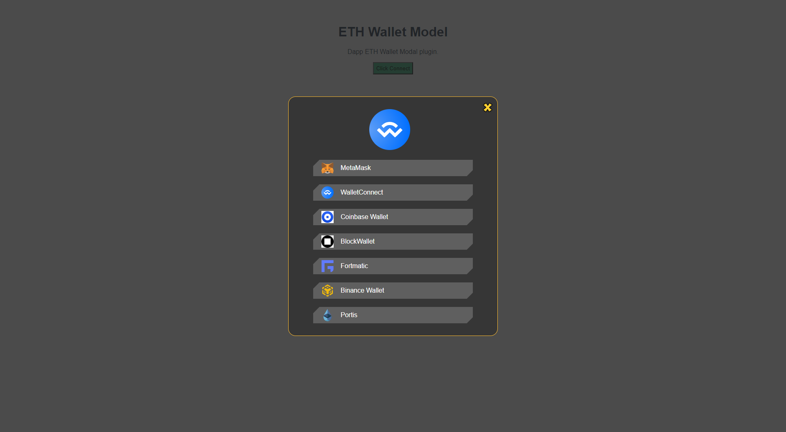

[English](./README.md) | 简体中文

<h1 align="center">
    ETH Wallet Modal
</h1>

[![npm][npm]][npm-url]  

<h3 align="center">
    以太坊钱包和Dapp提供商解决方案, 集成多Dapp钱包，可以轻松接入你的网站
</h3>

### 现在支持的 Dapp 钱包

<p float="left">


</p>

## 预览展示



## 演示案例

https://daudxu.github.io/eth-wallet-modal/

## 用法

### 1. 安装 eth-wallet-modal NPM 包

```
# 使用 NPM 安装
npm install --save eth-wallet-modal
# 或者使用 yarn 安装
yarn add eth-wallet-modal
```

### 2.将 eth-wallet-modal 添加到项目中，如下所示

```

import Web3 from "web3";
import ethWalletModal from "eth-wallet-modal";

const  providerOptions = {
        logo: LOGO,
        maskColor:'rgb(30, 30, 30, 0.8)',
        bgColor:'#363636',
        borderColor:'#faba30',
        chainId: 区块网络链ID,
        walletOptions: {
          metamask: {
            displayView: {
              logo: 你的 metamask LOGO 地址,
              name: "MetaMask",
            },
            options: {}
          },
          walletconnect: {
            displayView: {
              logo: 你的 walletconnect LOGO 地址,
              name: "WalletConnect",
            },
            options: {
              rpc: {
                1: 'https://mainnet.infura.io/v3/9aa3d95b3bc440fa88ea12eaa414516161',
                4: 'https://rinkeby.infura.io/v3/9aa3d95b3bc440fa88ea12ea221a4456161'
              },
              chainId: 区块网络链ID,
              bridge: 'https://bridge.walletconnect.org'
            }
          },
          coinbase: {
            displayView: {
              logo: 你的 coinbase LOGO 地址,
              name: "Coinbase Wallet",
            },
            options: {
              infuraId: '你的 infuraId ID',
              chainId: 区块网络链ID,
              appName: '你定义的应用名称',
              appLogoUrl: WalletConnectLogo,
              darkMode: false
            }
          },
          blockmallet: {
            displayView: {
              logo: 你的 blockmallet LOGO 地址,
              name: "BlockWallet",
            },
            options: {}
          },
          fortmatic: {
            displayView: {
              logo: 你的 fortmatic LOGO 地址,
              name: "Fortmatic",
            },
            options: {
              chainId: 区块网络链ID,
              key:'你的 fortmatic key'
            }
          },
          binancechainwallet: {
            displayView: {
              logo: 你的 binancechainwallet LOGO 地址,
              name: "Binance Wallet",
            },
            options: {}
          },
          portis: {
            displayView: {
              logo: 你的 portis LOGO 地址,
              name: "Portis",
            },
            options: {
                chainName: 'rinkeby', //mainnet,ropsten,rinkeby,goerli ...
                id:'你的 portis ID'
            }
          }
        }

      }

const WalletModal = new ethWalletModal(providerOptions);

const provider = await WalletModal.connect();

const web3 = new Web3(provider);
```

## 参数选项

| name            | type     | description           |
| --------------- | -------- | --------------------- |
| providerOptions | object   | see description below |
| connect         | function | return provider       |
| disconnect      | function | provider or null      |

providerOptions parameter

| name          | type   | description            |
| ------------- | ------ | ---------------------- |
| logo          | string | Your logo path address |
| maskColor     | string | mask Color             |
| bgColor       | string | Modal background color |
| borderColor   | string | Modal border color     |
| chainId       | int    | chain Id               |
| walletOptions | array  | See the table below    |

walletOptions parameter

| 名称               | 类型   | 描述                      |
| ------------------ | ----- | -------------------------------- |
| metamask           | 数组 | See the metamask below           |
| walletconnect      | 数组 | See the walletconnect below      |
| coinbase           | 数组 | See the coinbase below           |
| blockmallet        | 数组 | See the blockmallet below        |
| fortmatic          | 数组 | See the fortmatic below          |
| binancechainwallet | 数组 | See the binancechainwallet below |
| portis             | 数组 | See the portis below     |
| burnerconnect      | 数组 | See the burnerconnect below     |
| torus              | 数组 | See the torus below     |
| authereum          | 数组 | See the authereum below     |


metamask  配置
```
         metamask: {
            displayView: {
              logo: 'https://raw.org/metamask.svg'  // 你自己定义的 metamask logo 地址用于显示,   
              name: 'metamask'  // 你自己定义的 metamask 前端显示的名字 ,
            },
            options: {}   //无需传参
          },

```


walletconnect  配置
```
        walletconnect: {
          displayView: {
            logo: 'https://raw.org/walletconnect.svg'  // 你自己定义的 walletconnect logo 地址用于显示,   
            name: "WalletConnect",  // 你自己定义的 WalletConnect 前端显示的名字 ,
          },
          options: {
            rpc: {
              1: 'https://mainnet.infura.io/v3/9aa3d95b3bc440fa88ea12eaa414516161',
              4: 'https://rinkeby.infura.io/v3/9aa3d95b3bc440fa88ea12ea221a4456161'
            },
            chainId: 区块网络链ID,
            bridge: 'https://bridge.walletconnect.org'
          }
        },
```

coinbase  配置
```
         coinbase: {
            displayView: {
            logo: 'https://raw.org/coinbase.svg'  // 你自己定义的 Coinbase Wallet logo 地址用于显示,   
            name: "Coinbase Wallet",  // 你自己定义的 Coinbase Wallet 前端显示的名字 ,
            },
            options: {
              infuraId: '你的 infuraId ID',
              chainId: 区块网络链ID,
              appName: '你定义的应用名称',
              appLogoUrl: WalletConnectLogo,
              darkMode: false
            }
          },
```

blockmallet  配置
```
         coinbase: {
            displayView: {
            logo: 'https://raw.org/blockmallet.svg'  // 你自己定义的 blockmallet Wallet logo 地址用于显示,   
            name: "blockmallet",  // 你自己定义的 blockmallet Wallet 前端显示的名字 ,
            },
            options: {
              infuraId: '你的 infuraId ID',
              chainId: 区块网络链ID,
              appName: '你定义的应用名称',
              appLogoUrl: WalletConnectLogo,
              darkMode: false
            }
          },
```

fortmatic  配置
```
         coinbase: {
            displayView: {
            logo: 'https://raw.org/fortmatic.svg'  // 你自己定义的 fortmatic Wallet logo 地址用于显示,   
            name: "fortmatic",  // 你自己定义的 fortmatic Wallet 前端显示的名字 ,
            },
            options: {
              infuraId: '你的 infuraId ID',
              chainId: 区块网络链ID,
              appName: '你定义的应用名称',
              appLogoUrl: WalletConnectLogo,
              darkMode: false
            }
          },
```

binancechainwallet  配置
```
         coinbase: {
            displayView: {
            logo: 'https://raw.org/binancechainwallet.svg'  // 你自己定义的 binancechainwallet  logo 地址用于显示,   
            name: "binancechainwallet",  // 你自己定义的 binancechainwallet 前端显示的名字 ,
            },
            options: {
              infuraId: '你的 infuraId ID',
              chainId: 区块网络链ID,
              appName: '你定义的应用名称',
              appLogoUrl: WalletConnectLogo,
              darkMode: false
            }
          },
```

portis  配置
```
         coinbase: {
            displayView: {
            logo: 'https://raw.org/portis.svg'  // 你自己定义的 portis  logo 地址用于显示,   
            name: "portis",  // 你自己定义的 portis 前端显示的名字 ,
            },
            options: {
              infuraId: '你的 infuraId ID',
              chainId: 区块网络链ID,
              appName: '你定义的应用名称',
              appLogoUrl: WalletConnectLogo,
              darkMode: false
            }
          },
```

burnerconnect  配置
```
         coinbase: {
            displayView: {
            logo: 'https://raw.org/burnerconnect.svg'  // 你自己定义的 burnerconnect  logo 地址用于显示,   
            name: "burnerconnect",  // 你自己定义的 burnerconnect 前端显示的名字 ,
            },
            options: {
              infuraId: '你的 infuraId ID',
              chainId: 区块网络链ID,
              appName: '你定义的应用名称',
              appLogoUrl: WalletConnectLogo,
              darkMode: false
            }
          },
```


torus  配置
配置文档地址:   https://docs.tor.us/integration-builder/?b=wallet&chain=Ethereum&lang=Vue
```
         coinbase: {
            displayView: {
            logo: 'https://raw.org/coinbase.svg'  // 你自己定义的 Coinbase Wallet logo 地址用于显示,   
            name: "Coinbase Wallet",  // 你自己定义的 Coinbase Wallet 前端显示的名字 ,
            },
            options: {
              infuraId: '你的 infuraId ID',
              chainId: 区块网络链ID,
              appName: '你定义的应用名称',
              appLogoUrl: WalletConnectLogo,
              darkMode: false
            }
          },
       
```

authereum  配置
```
         coinbase: {
            displayView: {
            logo: 'https://raw.org/authereum.svg'  // 你自己定义的 authereum  logo 地址用于显示,   
            name: "authereum",  // 你自己定义的 authereum 前端显示的名字 ,
            },
            options: {
              infuraId: '你的 infuraId ID',
              chainId: 区块网络链ID,
              appName: '你定义的应用名称',
              appLogoUrl: WalletConnectLogo,
              darkMode: false
            }
          },
```


## 提供商订阅事件

```
// Subscribe to accounts change
provider.on("accountsChanged", (accounts: string[]) => {
  console.log(accounts);
});

// Subscribe to chainId change
provider.on("chainChanged", (chainId: number) => {
  console.log(chainId);
});

// Subscribe to provider connection
provider.on("connect", (info: { chainId: number }) => {
  console.log(info);
});

// Subscribe to provider disconnection
provider.on("disconnect", (error: { code: number; message: string }) => {
  console.log(error);
});
```


### 更新日志

#### 2022.02.21

> v1.0.0  
> 初始化项目版本
> 支持 MetaMask，WalletConnect

#### 2022.03.12

> v1.1.3 
> 添加支持 fortmatic, binance, portis
> 增加对遮罩背景色定制
> 模态框背景色自定义
> 模态框边框颜色自定义

#### 2022.03.19

> v1.1.6 
> 添加支持 fortmatic, binance, portis


## Features

- [v] Built for Ethereum using [Web3](https://github.com/ethereum/web3.js/).
- [v] Implements [Graph Protocol](https://github.com/graphprotocol) to read blockchain.


## other

- Etherscan: https://etherscan.io/apis
- Infura: https://infura.io/
- ETH Gas Station: https://docs.ethgasstation.info/
- Imgix: https://www.imgix.com/


[npm]: https://img.shields.io/npm/v/postcss-load-config.svg
[npm-url]: https://npmjs.com/package/postcss-load-config
[node]: https://img.shields.io/node/v/postcss-load-plugins.svg
[node-url]: https://nodejs.org/
